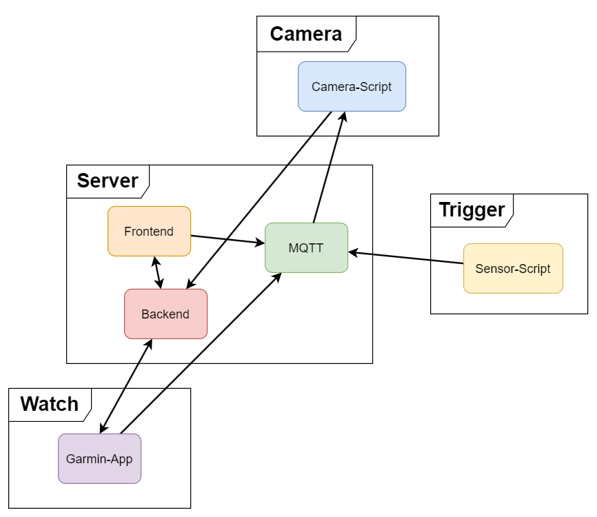
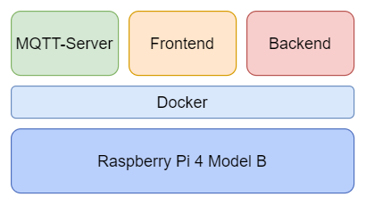

# ESP-Camera for Missing-Semester

In this project, we look into **hosting** and using **REST-APIs**.

## Project Structure

The project consist of 4 different parts:

- Server (Hosted on Raspberry Pi 4 Model B)
- Camera (esp32-cam modules)
- Trigger (ESP01 Wi-Fi-modules)
- Watch (Garmin Smartwatch)

Request are sent to the camera via MQTT hosted on the server. 

The camera is then taking a picture and sending it to the server as a HTTP POST request.

From there, the images can be viewed using the frontend webpage or the smartwatch app.

#### Server Structure

The server is using Docker to host the different applications.

